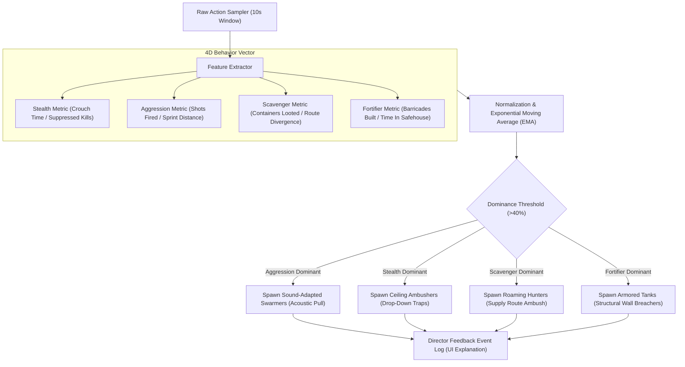
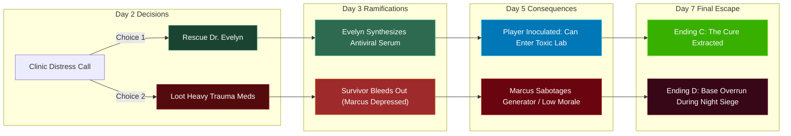

# GAME DESIGN DOCUMENT: ZOMBIE: STRING OF SURVIVAL

---

## 1. GAME TITLE
**ZOMBIE: STRING OF SURVIVAL**  
*(Working Title: The Survival String)*

---

## 2. ONE-LINE CONCEPT
A tense 7-day survival horror strategy game where an adaptive AI director learns from your playstyle, and every moral, tactical, and exploration decision weaves an irreversible narrative "string" that permanently reshapes the world, base defenses, zombie mutations, and your final escape.

---

## 3. STORY & LORE

### The Outbreak
On Day 0, the metropolitan city of **Aethelgard** fell silent. What began as reports of sudden neurological paralysis rapidly mutated into violent biological hyperactivity: the infected lost optical vision, developed calcified bone armor, hyper-sensitive acoustic hearing, and aggressive predatory instincts. The military established a perimeter, sealed the bridges, and declared Quarantine Zone 9.

### The 7-Day Narrative Arc
The player steps into the boots of **Alexei**, an ex-civil engineer trapped in District 4. An emergency radio broadcast crackles: **"All remaining uninfected: Extraction flight Zulu-9 will land at the Harbor Naval Outpost on Day 7 at 06:00. The quarantine zone will then undergo absolute thermal sterilization."**

- **Day 1 (The Fall)**: Alexei awakens in an abandoned subway station. Basic walkers roam the debris. Alexei secures an old industrial workshop as the first Safehouse.
- **Day 2 (First Voices)**: Radio calls lead to the local clinic where Dr. Evelyn Reed is pinned down. Alexei must choose: extract Evelyn or secure her heavy trauma-med crate.
- **Day 3 (The Mutation)**: Red bio-organic tendrils begin crawling over concrete walls. "Ambushers" appear clinging to ceilings. Alexei discovers audio cassettes from Biogenix Labs: the virus wasn't accidental—it was a military neural-enhancement project that went berserk under high acoustic stimulation.
- **Day 4 (Civil Strife & Siege)**: Rival survivors or desperate refugees arrive at the Safehouse gate. Tensions rise over rationing. At night, the horde tests the outer fence.
- **Day 5 (The Belly of the Beast)**: Power failure forces an expedition down into the flooded Underground Transit Tunnels leading directly beneath Biogenix Central Lab. Alexei uncovers the master pathogen synthesis strain.
- **Day 6 (The Convergence)**: The city reaches maximum infection density. A massive chemical storm rolls in. All remaining resources must be stockpiled and the extraction route scouted.
- **Day 7 (Extraction or Oblivion)**: The sirens blare. The horde launches an apocalyptic final assault on the Safehouse and the extraction corridor. Survival depends entirely on the defensive grid built, the survivors alive, and the zombie weaknesses discovered.

---

## 4. GAMEPLAY OVERVIEW
The game seamlessly blends three distinct gameplay perspectives:
1. **Real-time Tactical Survival (Daytime Exploration)**: Third-person or top-down exploration of dilapidated city blocks. Scavenging food, medicine, tools, and ammo with dynamic line-of-sight and flashlight mechanics.
2. **Base Construction & Resource Management (Twilight Phase)**: Allocating materials to fortify barricades, craft ammo, repair generators, assign survivor shifts, and treat injuries.
3. **High-Tension Night Defense & Stealth**: Holding out against nighttime raids or executing high-stakes nocturnal supply runs under total darkness with mutating predators.

```
┌────────────────────────────────────────────────────────┐
│                   DAILY CORE GAME LOOP                 │
│                                                        │
│  [06:00 - 18:00] EXPLORATION & RESCUE                  │
│    • Scavenge residential / commercial / military zones│
│    • Encounter survivors & commit String Decisions    │
│    • AI Director samples behavior telemetry every 10s │
│                     │                                  │
│                     ▼                                  │
│  [18:00 - 21:00] BASE UPGRADES & PREPARATION           │
│    • Construct barricades, manage appliance Heat      │
│    • Assign survivor jobs (Doctor, Engineer, Guard)   │
│                     │                                  │
│                     ▼                                  │
│  [21:00 - 06:00] NIGHT SIEGE & HORDE SURVIVAL          │
│    • Base Heat attracts dynamic horde radius          │
│    • Defend walls or execute stealth nocturnal runs   │
│                     │                                  │
│                     ▼                                  │
│  [06:00 DAWN] SURVIVAL STRING STATE RESOLUTION         │
│    • Downstream pathways unlocked                     │
│    • Mutations evolve based on player telemetry       │
│    • Advance to Next Day                              │
└────────────────────────────────────────────────────────┘
```

---

## 5. MAIN MECHANICS

1. **The Survival String (Graph State Machine)**:
   - Replaces binary flags with a Directed Acyclic Graph (DAG).
   - Every major action creates an immutable node.
   - Nodes fire UnityEvents that alter 3D models (swapping broken generators for running generators), modify NavMesh links (opening tunnels, blowing bridges), and alter survivor loyalty.
2. **Base Heat System (Dynamic NavMesh Trigger)**:
   - Operating appliances (Diesel Generator, Floodlights, Radios, Workbenches) emits numerical `Heat`.
   - An invisible spherical trigger expands: `TriggerRadius = TotalHeat * 2.0m`.
   - Any wandering zombie touching this radius instantly locks its `NavMeshAgent` target onto the Safehouse door.
3. **Noise & Acoustic Visibility**:
   - Gunshots, sprinting, and kicked debris emit sound rings.
   - Blind zombies navigate via acoustic vectors rather than visual cones.
4. **Organic Infection Meter**:
   - No UI health bar for infection.
   - Perceived organically: screen chromatic aberration, pulsating bio-veins creeping from viewport edges, camera FOV fever breathing, and Audio Mixer Low-Pass filtering.
5. **Physical Resource Weight & Backpack Grid**:
   - Limited inventory grid slots.
   - Carrying heavy building scrap drains stamina faster and increases acoustic footstep noise.

---

## 6. ZOMBIE TYPES & ARCHETYPES

| Zombie Archetype | Visual & Auditory Profile | Behavior & Mechanics | Countered Playstyle |
| :--- | :--- | :--- | :--- |
| **1. Walker (Standard)** | Rotting civilian attire, slow shamble, raspy groaning. | Slow wanderer; dangerous in tight hallways or when grouped. | Baseline baseline threat. |
| **2. Fast Zombie (Sprinter)** | Freshly infected athlete/police, twitching limbs, high-pitched shrieks. | Sprints at 1.8x player walking speed; leaps over low barricades. | Punishes open-street running without stamina. |
| **3. Sound-Adapted Swarmer** | Calcified bone covering eyes, massive bat-like ears, exposed jaw. | Completely blind. Hyper-sensitive to gunfire and sprinting. Summons horde calls. | **Counters Aggressive Players** (Spawns when gunfire > 40%). |
| **4. Ceiling Ambusher** | Emaciated, charcoal-black skin, 25cm bone claws, glowing pale eyes. | Clings silently to ceiling rafters, duct vents, and streetlamp poles. Drops directly onto crouching players. | **Counters Stealth Players** (Spawns when crouch time > 40%). |
| **5. Relentless Hunter** | Tactical vest remnants, scarred face, low guttural growl. | Roams supply routes and loot caches. Tracks opened containers and blood trails. | **Counters Scavenger / Balanced Players**. |
| **6. Tank (Goliath)** | Mutated riot officer with fused ballistic shield armor and bloated muscular bulk. | Smashes wooden barricades in 2 hits; immune to 9mm pistol rounds from the front. | Requires environmental traps, fire, or high-caliber rifles. |
| **7. Adaptive Chimera** | Shifting biomechanical mass with fluctuating bio-luminescence. | Analyzes player tactics mid-fight: gains bullet resistance if shot repeatedly, or releases blinding spore smoke if cornered. | Dynamic endgame nightmare. |

---

## 7. SURVIVOR SYSTEM

Survivors are distinct characters with backstories, specialized skills, trust meters (0 to 100), and emotional states.

```
               ┌──────────────────────────────────────┐
               │         SURVIVOR ARCHETYPES          │
               ├──────────────────────────────────────┤
               │  DR. EVELYN REED (Medical Doctor)    │
               │  Skill: Treats infection & trauma    │
               │  Weakness: Pacifist, low stamina     │
               ├──────────────────────────────────────┤
               │  MARCUS VANCE (Combat Engineer)      │
               │  Skill: Auto-turrets & trap crafting │
               │  Weakness: Heavy smoker (makes noise)│
               ├──────────────────────────────────────┤
               │  SGT. DARIUS COLE (Ex-Military)      │
               │  Skill: High damage, base guard      │
               │  Weakness: PTSD panic episodes       │
               ├──────────────────────────────────────┤
               │  DR. ARLO CHEN (Biogenix Virologist) │
               │  Skill: Synthesizes pathogen cure    │
               │  Weakness: High infection risk       │
               └──────────────────────────────────────┘
```

### Survivor Mechanics:
- **Work Shifts**: Assign survivors to Guard Duty (reduces base attack damage), Workshop (crafts ammo/planks), Medical Bay (slows infection), or Rest.
- **Moral String Decisions**:
  - *Example 1*: An injured survivor arrives infected. Do you spend your last antiviral dose on them, quarantine them, or exile them into the street? Exiling them causes other survivors to lose trust (-30%), and the exiled survivor might return later as an elite mutated zombie!
  - *Example 2*: The Doctor refuses to work if you torture a captured bandit for the armory keycard.

---

## 8. BASE BUILDING SYSTEM

The player establishes their headquarters at the **District 4 Industrial Substation**.

### Upgradable Modules:
1. **Outer Perimeter**:
   - Level 1: Wooden Barricades (cheap, low durability).
   - Level 2: Chainlink Fence with Barbed Wire (slows fast zombies).
   - Level 3: Reinforced Steel Sheet Wall with spikes (stops Tanks).
2. **Defense Installations**:
   - Watchtower (allows assigned sniper survivor to pick off approaching zombies).
   - Caltrop Spikes & Electric Wire (requires generator power).
   - Automated Sentry Turrets (crafted by Engineer, requires 5.56mm ammo).
3. **Internal Facilities**:
   - **Diesel Generator**: Powers lights, battery chargers, and electric fences. Generates +35 Heat.
   - **Workbench**: Repairs damaged melee weapons, crafts improvised suppressor attachments and pipe bombs.
   - **Medical Sickbay**: Halts infection progression and heals fracture injuries.
   - **Water Filtration Unit**: Purifies rainwater from toxic radioactive fallout.
   - **Research Station**: Analyzes tissue samples collected from mutant zombies to unlock weapon damage multipliers.

---

## 9. RESOURCE & SURVIVAL METRICS

The player must constantly manage 6 core personal survival meters alongside 7 base inventory commodities:

### Player Status Meters:
- **Health (0-100)**: Reduced by zombie hits and bleeding.
- **Stamina (0-100)**: Consumed by sprinting, swinging heavy bats, and vaulting.
- **Hunger (0-100)**: Depletes over 12 real-world minutes; at 0, stamina regeneration stops.
- **Thirst (0-100)**: Depletes over 8 real-world minutes; at 0, vision blurs and aim sways.
- **Infection (0-100)**: Diegetic float; increases from zombie bites and toxic spores.
- **Body Temperature**: Freezing in night rain causes shivering (aim penalty) and hypothermia.

### Base Stockpile Commodities:
1. **Canned Food** (Feeds survivors daily; starved survivors stop working).
2. **Clean Water** (Essential for human life and cooling overheated generators).
3. **Medical Supplies** (Antibiotics, bandages, splints, antiviral ampoules).
4. **Ammunition** (9mm, 12-Gauge Shells, 5.56mm, Crossbow Bolts).
5. **Scrap Metal** (Used for reinforcing walls and repairing firearms).
6. **Timber / Wood** (Used for barricades, boarding windows, and campfire warmth).
7. **Electronics** (Circuit boards, wires, sensors for turrets and radios).

---

## 10. DAY / NIGHT SYSTEM

A complete 24-hour in-game cycle lasts **20 real-time minutes** (14 minutes Day, 6 minutes Night).

```
DAYTIME [06:00 - 18:00]
═════════════════════════════════════════════════════════════════════════
• High visibility (full sunlight, clear line-of-sight).
• Standard Walkers roam outdoors; mutated types sleep inside dark basements.
• Safe scavenging, survivor rescue, and base structural reinforcement.
• Zombie reaction time is sluggish (-30% detection radius).

NIGHTTIME [18:00 - 06:00]
═════════════════════════════════════════════════════════════════════════
• Pitch black (requires flashlight or night-vision goggles).
• Mutated zombies awake and roam streets in coordinated packs.
• Base Heat attracts the nocturnal horde; siege encounters trigger.
• High Risk / High Reward: Military supply drops and rare biochemical loot
  can only be retrieved under cover of darkness!
```

---

## 11. ZOMBIE MUTATION SYSTEM (DAY 1 TO 7)

The pathogen is not static; it evolves dynamically across the 7 days:

```
Day 1: DORMANT STRAIN
  └─ Slow Walkers only; minimal motor coordination.

Day 2: MOTOR HYPERACTIVITY
  └─ 20% of infected mutate into Sprinters; agile vaulting over fences.

Day 3: CALCIFICATION & ACOUSTIC SPECIALIZATION
  └─ Sound-Adapted Swarmers emerge; auditory detection range triples.

Day 4: SHADOW ADAPTATION
  └─ Ambushers develop chameleon pigmentation; ceiling wall-crawling active.

Day 5: CHITINOUS PLATING
  └─ Armored Tanks appear; small-arms fire ricochets off head/chest.

Day 6: VIRAL BIO-SPORES
  └─ Exploding Bloaters and toxic aerosol spore zones coat subway tunnels.

Day 7: SUPER-HORDE CONVERGENCE
  └─ Hivemind coordination; Goliath Titans lead targeted breaches on safehouses.
```

---

## 12. ADAPTIVE AI & MACHINE LEARNING COMPONENT

The game incorporates an **Explainable Behavior Mirror AI Engine**:



### Telemetry Feature Vector:
$$\vec{v} = \begin{bmatrix} w_{\text{stealth}} \\ w_{\text{aggression}} \\ w_{\text{scavenge}} \\ w_{\text{defense}} \end{bmatrix}, \quad \sum_{i} w_i = 1.0$$

- **Explainability**: In the game’s UI, a diegetic **"Director Neural Log"** shows the player *why* enemies changed:
  > *"AI Director Warning: Aggression ratio has reached 58% due to sustained automatic gunfire. The horde has evolved acoustic bone membranes to triangulate your position."*

---

## 13. STRING OF SURVIVAL SYSTEM (THE UNIQUE MECHANIC)

Every consequential decision in the game is registered into an interactive, visual Directed Acyclic Graph (DAG) called the **Survival String Board** (resembling a detective’s digital corkboard).



### Visual String Mechanics:
- **Red Strings**: Represent irreversible sacrifices, character deaths, or scorched-earth tactics.
- **Amber Strings**: Represent resource trades, tactical concessions, and uneasy alliances.
- **Cyan / Gold Strings**: Represent breakthrough discoveries, survivor rescues, and technological advancements.
- **Hidden Nodes**: Downstream nodes remain masked by shadow until prerequisites are met, encouraging replayability.

---

## 14. CONNECTED WORLD MAP

A sprawling, semi-open urban sandbox connected by roads, alleys, and underground infrastructure:

```
[OUTSKIRTS / FOREST] 
        │
[HIGHWAY BRIDGE] ────── [MILITARY CHECKPOINT 04]
        │                           │
[RESIDENTIAL DISTRICT] ──── [POLICE HEADQUARTERS]
        │                           │
[SAFEHOUSE BASE] ────────── [SHOPPING MALL]
        │                           │
[CITY HOSPITAL] ─────────── [METRO TUNNELS]
                                    │
                            [BIOGENIX LABS] ──── [HARBOR EXTRACTION]
```

### Location Profiles:
1. **Safehouse Base**: The heart of operations. Highly customizable and fortifiable.
2. **Residential District**: High density of canned food, water, and civilian survivor encounters; narrow choke points.
3. **City Hospital**: Abundant medicine, defibrillators, and surgical tools; infested with blinded hospital patients and toxic bloaters.
4. **Police Headquarters**: High-tier firearms (shotguns, pistols, body armor); high zombie presence.
5. **Metro Underground Tunnels**: Pitch black; bypasses street hordes but infested with ceiling Ambushers.
6. **Biogenix Central Lab**: High-tech keycard doors; holds origin documents, pathogen samples, and experimental prototype weapons.
7. **Harbor Extraction Pier**: The final destination for Day 7 evacuation.

---

## 15. MISSIONS & DAY-BY-DAY OBJECTIVES

### Day 1: Ground Zero
- **Primary**: Escape the train depot, scavenge a primary melee weapon, and secure the District 4 Substation.
- **Secondary**: Find a working radio battery.

### Day 2: The First Thread
- **Primary**: Investigate the distress signal from St. Jude’s Clinic.
- **String Choice**: Rescue Dr. Evelyn or salvage the emergency medical crate.
- **Base Objective**: Construct perimeter wooden barricades before 21:00.

### Day 3: Silent Hunters
- **Primary**: Track a missing survivor squad into the Police Precinct to acquire high-caliber ammunition.
- **AI Adaptation**: Sound-Adapted Swarmers appear. Craft first improvised suppressor.
- **String Choice**: Download police criminal database (reveals hidden bunker) OR activate precinct backup generator.

### Day 4: Siege & Fracture
- **Primary**: Defend the Safehouse from a coordinated midnight horde attack.
- **String Choice**: A starving refugee family begs for shelter at 02:00. Admit them (risks disease/theft) or turn them away (survivors suffer moral loss).

### Day 5: Subterranean Descent
- **Primary**: Navigate the flooded metro tunnels to restore power to Biogenix Lab.
- **Encounter**: First boss battle against an Armored Goliath in the subway terminal.
- **String Choice**: Purge the lab air filtration system (kills infected test subjects inside) OR venture through contaminated vents manually.

### Day 6: The Gathering Storm
- **Primary**: Gather fuel canisters and repair the Harbor Extraction signal flare beacon.
- **Secondary**: Resolve survivor disputes; ensure all survivors are armed and healed.

### Day 7: The Extraction String
- **Final Mission**: Defend the Harbor Gate for 10 minutes against the apocalyptic Super-Horde until the naval landing craft drops its ramp.

---

## 16. PLAYER PROGRESSION (SKILL TREES)

Skills level up naturally through gameplay actions (practice makes perfect):

```
┌─────────────────────────────────────────────────────────────────┐
│                    PLAYER PROGRESSION MATRIX                    │
├─────────────────┬───────────────────────────────────────────────┤
│ COMBAT          │ • Steady Grip (-40% weapon recoil)            │
│                 │ • Heavy Swing (melee blunt knockback)         │
│                 │ • Executioner (silent knife takedowns)        │
├─────────────────┼───────────────────────────────────────────────┤
│ STEALTH         │ • Light Footsteps (-50% acoustic foot noise)  │
│                 │ • Shadow Veil (harder to spot in dark)        │
│                 │ • Ghost Crawl (faster movement while crouched)│
├─────────────────┼───────────────────────────────────────────────┤
│ ENGINEERING     │ • Scrapper (+30% metal salvaged from wrecks)   │
│                 │ • Fortifier (+50% barricade hit points)       │
│                 │ • Master Electrician (turrets consume -25% W) │
├─────────────────┼───────────────────────────────────────────────┤
│ SURVIVAL        │ • Iron Stomach (can drink unpurified water)   │
│                 │ • Pack Mule (+4 inventory slots)              │
│                 │ • Thick Skin (-20% infection chance on bite)  │
├─────────────────┼───────────────────────────────────────────────┤
│ LEADERSHIP      │ • Inspiring Presence (+15% survivor accuracy) │
│                 │ • Crisis Negotiator (prevents base mutiny)    │
│                 │ • Field Commander (can command 2 companions)  │
└─────────────────┴───────────────────────────────────────────────┘
```

---

## 17. MULTIPLE ENDINGS (STRING-DRIVEN)

Your final playthrough outcome is calculated from your String DAG state on Day 7:

```
                  ┌──────────────────────────────┐
                  │    DAY 7 EXTRACTION PIER     │
                  └──────────────┬───────────────┘
                                 │
         ┌───────────────────────┼───────────────────────┐
         │                       │                       │
         ▼                       ▼                       ▼
    [Lab Strain             [Base Fully             [Infection > 80%
    Synthesized]             Fortified]             & Crew Escapes]
         │                       │                       │
         ▼                       ▼                       ▼
   ENDING A: CURE          ENDING B: HAVEN         ENDING E: MARTYR
   Player extracts         Survivors secure        Player stays behind
   with synthesis data.    the city district;      on the turret to hold
   Global vaccine born.    new permanent colony.   the horde as crew flies.
```

- **Ending A (The Cure Delivered)**: You saved Dr. Arlo Chen, bypassed lab security, and extracted with the master pathogen synthesis strain. Humanity’s cure begins production.
- **Ending B (Fortified Sanctuary)**: You focused heavily on base fortification, solar energy, and agriculture. Instead of fleeing on the boat, your community repels the horde and declares District 4 an autonomous free zone.
- **Ending C (Pyrrhic Evacuation)**: You escape alone on the final helicopter; the safehouse fell, your companions perished, and the city is incinerated by military airstrikes.
- **Ending D (Viral Assimilation)**: Your infection level crossed 100% during the extraction battle. You turn into the apex mutant chimera, hunting the remaining evacuees.
- **Ending E (The Final String)**: You sacrifice yourself by manually detonating the harbor bridge fuel tanks, buying precious seconds for Evelyn and the surviving children to sail into the ocean.

---

## 18. USER INTERFACE (UI/UX)

### Diegetic In-Game HUD:
- **No Floating Bars**: Visual clarity is paramount. Health is indicated by bloody vignette; stamina by audio panting and subtle posture shifts.
- **Wrist Compass & Timepiece**: Alexei checks his mechanical wristwatch to see the time of day and minutes until sunset.
- **Backpack Inventory Grid**: Resident Evil-style spatial grid (weapons take 2x4 slots, ammo takes 1x1, bandages 1x2).

### The Survival String Interface (Hotkey: J / Journal):
- A gritty, digital holographic board rendered with neon amber and blood-red nodes.
- Shows timeline connections, survivor portraits, active world state changes, and causal relationships.
- Tooltips explain the exact past choices that caused current world conditions.

---

## 19. AUDIO & SOUND DESIGN

- **Psychoacoustic Soundscapes**: High tension drone synthesizers mixed with low-frequency cello drones.
- **Dynamic Acoustic Engine**: Sound propagates through open doorways and reverberates off tiled hospital corridors. Gunshots echo through city canyons, triggering distant zombie cries.
- **Diegetic Heartbeat Monitor**: As infection or panic rises, Alexei’s heartbeat thumps through the subwoofer, while high-frequency ear ringing (tinnitus) drowns out environmental footsteps.
- **Spatial 3D Whispers**: When infection > 50%, eerie auditory hallucinations whisper directly into the left or right earcups, deceiving the player into checking their flanks.

---

## 20. TECHNICAL ARCHITECTURE (UNITY 6 C#)

### Core Namespaces & Systems:
```
Assets/Scripts/
├── SurvivalString/
│   ├── DecisionNode.cs            # ScriptableObject defining DAG nodes, edges & UnityEvents
│   ├── SurvivalStringManager.cs   # Singleton manager, O(1) lookups, zero Update() loops
│   └── WorldStateSwapper.cs       # Swaps 3D models and carves NavMesh obstacles
├── AIDirector/
│   ├── PlayerTelemetry.cs         # 5s sampling window; normalizes 4-score behavior vector
│   ├── ZombieDirector.cs          # Evaluates dominance (>40%) & selects enemy archetype
│   └── ZombieSpawnManager.cs      # NavMesh-weighted prefab spawning pool
├── BaseHeat/
│   ├── HeatSource.cs              # Appliance component (Generator, Radio, Lights)
│   └── BaseHeatManager.cs         # Dynamically scales trigger SphereCollider (R = Heat * 2)
├── Infection/
│   ├── InfectionManager.cs        # Diegetic 0-100 float; drives shaders, FOV, and Audio LPF
│   └── InfectionPostProcessEffect.cs # Fullscreen camera blit pass
└── Common/
    └── ZombieNavMeshController.cs # NavMeshAgent controller responding to heat & sounds
```

---

## 21. AI / ML ARCHITECTURE SPECIFICATION

### Continuous Ingestion Pipeline:
1. **Sampling Timer**: An asynchronous coroutine samples metrics every 5 seconds.
2. **Metrics Collected**:
   $$M = \{ \text{shotsFired}, \Delta \text{distanceSprinted}, \Delta t_{\text{crouch}}, \text{containersLooted}, \text{baseRepairs} \}$$
3. **Weighting & Exponential Moving Average (EMA)**:
   $$S_t = \alpha \cdot \text{RawScore}_t + (1 - \alpha) \cdot S_{t-1}, \quad \text{where } \alpha = 0.6$$
4. **Dominance Classifier**:
   $$\text{DominantPlaystyle} = \arg\max_i (w_i), \quad \text{Condition: } \max(w_i) \ge 0.40$$
5. **Encounter Rebalancing**: Directly swaps the probability weights inside `ZombieSpawnManager` to spawn counters:
   - High Aggression $\rightarrow$ 85% Swarmer weighting.
   - High Stealth $\rightarrow$ 85% Ambusher weighting.

---

## 22. MINIMUM VIABLE PRODUCT (MVP) DEVELOPMENT PLAN

To ensure practical execution for a student or indie team, development is structured into clear phased sprints:

### Phase 1: The 2-Week Core Prototype (MVP)
- **Scope**:
  - **Map**: 1 small city intersection + 1 interior Safehouse.
  - **Player**: Basic character controller with WASD movement, flashlight, pistol, and crouch.
  - **Zombies**: 3 Archetypes (Standard Walker, Sound-Adapted Swarmer, Ceiling Ambusher).
  - **Systems**:
    1. Base Heat Manager with 1 toggleable Diesel Generator and dynamic attraction radius.
    2. Player Telemetry coroutine sampling shots fired vs. crouch time.
    3. 3-Node Survival String prototype (`SAVE_ENGINEER` $\rightarrow$ `REPAIR_GENERATOR` vs `SABOTAGE_GENERATOR`).
  - **Objective**: Defend the safehouse for 3 in-game days.

### Phase 2: Vertical Slice (Weeks 3–6)
- Implement full Day/Night lighting cycle and Audio Mixer Low-Pass Filter.
- Add inventory grid, weapon durability, and 3 survivor NPCs.
- Expand map to include Hospital and Police Station blocks.
- Build full 7-day progression timeline.

### Phase 3: Polish & Content Expansion (Weeks 7–10)
- Add all 7 endings and complete 24-node DAG graph.
- Implement post-processing bio-vein shader and spatial 3D whispering audio.
- Perform playtesting, balance economy curves, and package executable demo.

---

## 23. FUTURE EXPANSION IDEAS

1. **2-Player Co-op Campaign ("Tethered Strings")**:
   - Both players share the same Survival String board, but can make conflicting decisions (e.g., Player 1 saves a survivor while Player 2 loots the medical crate), leading to emergent narrative tension.
2. **Community String Editor (Steam Workshop)**:
   - Visual drag-and-drop tool allowing players to design custom custom narrative campaigns, quests, and mutant variants.
3. **Endless Horde Survival Mode ("Day 8 and Beyond")**:
   - Rogue-like survival mode where the city becomes permanently mutated, and waves scale indefinitely with procedural objectives.
4. **Procedural City Quarantine Districts**:
   - Procedural street generation connecting suburban, industrial, and downtown biomes with randomized loot placements.
