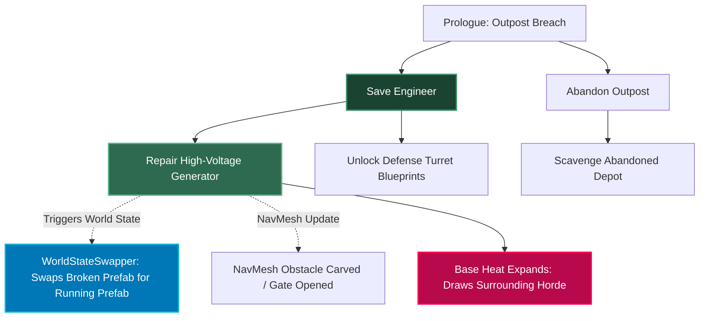
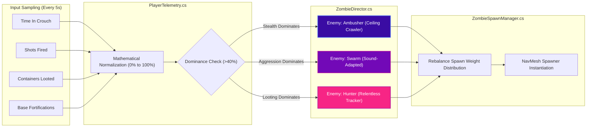
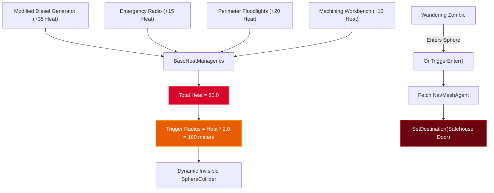

# The Survival String: Deep-Dive Feature Architecture & Implementation

> **Platform**: Unity 6 (URP / Built-in)  
> **Architecture Paradigm**: ScriptableObject Directed Acyclic Graph (DAG), Event-Driven AI Director, Dynamic Spatial NavMesh Attraction, and Diegetic Audio-Visual Post-Processing.

---

## 🎨 Visual Assets & Concept Art

Here are the visual concept art pieces and UI designs generated for **The Survival String**:

*UI Concept: The Survival String digital narrative board showing interconnected survivor and mission nodes.*

*Environment Concept: Day 7 Chaos showing organic red bio-veins mutating concrete buildings around quarantine barricades.*

*Gameplay Mockup: First-person survival stealth encounter facing a blind, sound-adapted Swarmer.*

---

## 🏛️ System Architecture Diagrams

### 1. The Survival String (Graph-Based State Machine)

### 2. Player Behavior Mirror (AI Director Feedback Loop)

### 3. Base Heat Attraction System

---

## 💻 Implemented Codebase & File References

All C# scripts, shaders, and inspectors have been generated and structured into the workspace:

| System | Component / Asset | Description |
| :--- | :--- | :--- |
| **Survival String** | [DecisionNode.cs](file:///c:/Users/Samiksha%20Patil/OneDrive/Desktop/promptgame/Assets/Scripts/SurvivalString/DecisionNode.cs) | ScriptableObject defining nodes, prerequisites, edges, and UnityEvent world alteration hooks. |
| **Survival String** | [SurvivalStringManager.cs](file:///c:/Users/Samiksha%20Patil/OneDrive/Desktop/promptgame/Assets/Scripts/SurvivalString/SurvivalStringManager.cs) | High-performance Singleton manager with `HashSet<string>` O(1) lookups, zero `Update()` calls, JSON export/import. |
| **Survival String** | [WorldStateSwapper.cs](file:///c:/Users/Samiksha%20Patil/OneDrive/Desktop/promptgame/Assets/Scripts/SurvivalString/WorldStateSwapper.cs) | Inspector utility triggered by node activation to swap 3D prefabs and carve/open NavMesh routes. |
| **Survival String** | [SurvivalStringManagerEditor.cs](file:///c:/Users/Samiksha%20Patil/OneDrive/Desktop/promptgame/Assets/Scripts/SurvivalString/Editor/SurvivalStringManagerEditor.cs) | Custom Unity Editor Inspector allowing one-click node testing and DAG pathway inspection. |
| **AI Director** | [PlayerTelemetry.cs](file:///c:/Users/Samiksha%20Patil/OneDrive/Desktop/promptgame/Assets/Scripts/AIDirector/PlayerTelemetry.cs) | 5-second sampling coroutine tracking Stealth, Aggression, Looting, and BaseBuilding with >40% dominance event. |
| **AI Director** | [ZombieDirector.cs](file:///c:/Users/Samiksha%20Patil/OneDrive/Desktop/promptgame/Assets/Scripts/AIDirector/ZombieDirector.cs) | Listens to telemetry shifts and dynamically switches `CurrentEnemyType` (`Swarm`, `Ambusher`, `Hunter`). |
| **AI Director** | [ZombieSpawnManager.cs](file:///c:/Users/Samiksha%20Patil/OneDrive/Desktop/promptgame/Assets/Scripts/AIDirector/ZombieSpawnManager.cs) | Rebalances archetype spawn weight distributions and places enemies onto valid NavMesh coordinates. |
| **Base Heat** | [HeatSource.cs](file:///c:/Users/Samiksha%20Patil/OneDrive/Desktop/promptgame/Assets/Scripts/BaseHeat/HeatSource.cs) | Appliance component with heat output and toggle state that registers with `BaseHeatManager`. |
| **Base Heat** | [BaseHeatManager.cs](file:///c:/Users/Samiksha%20Patil/OneDrive/Desktop/promptgame/Assets/Scripts/BaseHeat/BaseHeatManager.cs) | Singleton scaling an invisible trigger `SphereCollider` (`Radius = Heat * 2`) and redirecting zombies to base core. |
| **Infection** | [InfectionManager.cs](file:///c:/Users/Samiksha%20Patil/OneDrive/Desktop/promptgame/Assets/Scripts/Infection/InfectionManager.cs) | Diegetic float (0.0 to 100.0) driving shader chromatic aberration, audio mixer LPF cutoff, and 3D ear whispers. |
| **Infection** | [OrganicInfectionScreenEffect.shader](file:///c:/Users/Samiksha%20Patil/OneDrive/Desktop/promptgame/Assets/Shaders/OrganicInfectionScreenEffect.shader) | Fullscreen post-processing shader with procedural bio-vein creeping tendrils, chromatic dispersion, and vignette. |
| **Infection** | [InfectionPostProcessEffect.cs](file:///c:/Users/Samiksha%20Patil/OneDrive/Desktop/promptgame/Assets/Scripts/Infection/InfectionPostProcessEffect.cs) | Screen-space blit component for camera rendering in Built-in RP and URP. |
| **Common** | [ZombieNavMeshController.cs](file:///c:/Users/Samiksha%20Patil/OneDrive/Desktop/promptgame/Assets/Scripts/Common/ZombieNavMeshController.cs) | NavMesh agent controller responding to base heat alert destinations and wander states. |
| **Diagnostic** | [GameplayTestHarness.cs](file:///c:/Users/Samiksha%20Patil/OneDrive/Desktop/promptgame/Assets/Scripts/Demo/GameplayTestHarness.cs) | Interactive runtime GUI (press `F1`) to simulate all 4 systems live in any Unity scene. |

---

## 🛠️ Step-by-Step Unity 6 Integration Guide

### 1. The Survival String Setup
1. In Unity, select `Assets > Create > Survival String > Decision Node` to create your initial decision nodes:
   - `RESCUE_ENGINEER`
   - `REPAIR_GENERATOR` (Add `RESCUE_ENGINEER` to `Prerequisite Node IDs`)
   - `SABOTAGE_GENERATOR` (Add `REPAIR_GENERATOR` to `Mutually Exclusive Node IDs`)
2. In your scene, add a GameObject named `[Managers]` and attach [SurvivalStringManager.cs](file:///c:/Users/Samiksha%20Patil/OneDrive/Desktop/promptgame/Assets/Scripts/SurvivalString/SurvivalStringManager.cs).
3. Drag your `DecisionNode` assets into the `Node Catalog` list.
4. On scene objects (such as a broken generator), attach [WorldStateSwapper.cs](file:///c:/Users/Samiksha%20Patil/OneDrive/Desktop/promptgame/Assets/Scripts/SurvivalString/WorldStateSwapper.cs):
   - Set `Objects To Disable` ➔ `Broken_Generator`
   - Set `Objects To Enable` ➔ `Running_Generator`
   - Connect this method to the `OnNodeActivated` UnityEvent on the `DecisionNode`.

### 2. Player Behavior Mirror & Telemetry Setup
1. Attach [PlayerTelemetry.cs](file:///c:/Users/Samiksha%20Patil/OneDrive/Desktop/promptgame/Assets/Scripts/AIDirector/PlayerTelemetry.cs) and [ZombieDirector.cs](file:///c:/Users/Samiksha%20Patil/OneDrive/Desktop/promptgame/Assets/Scripts/AIDirector/ZombieDirector.cs) to the manager object.
2. In your player movement / weapon script:
   - Call `PlayerTelemetry.Instance.ReportShotFired()` when firing.
   - Call `PlayerTelemetry.Instance.SetCrouchState(true/false)` when crouching.
   - Call `PlayerTelemetry.Instance.ReportLootOpened()` when opening supply crates.
3. Attach [ZombieSpawnManager.cs](file:///c:/Users/Samiksha%20Patil/OneDrive/Desktop/promptgame/Assets/Scripts/AIDirector/ZombieSpawnManager.cs) to a spawner GameObject and assign your 3 enemy prefabs.

### 3. Base Heat Setup
1. Place a GameObject at the center of the Safehouse (e.g. `Safehouse_Core`) and attach [BaseHeatManager.cs](file:///c:/Users/Samiksha%20Patil/OneDrive/Desktop/promptgame/Assets/Scripts/BaseHeat/BaseHeatManager.cs).
2. Assign `Base Target Point` to the front barricade or door transform.
3. On your Generator, Radio, and Floodlights, attach [HeatSource.cs](file:///c:/Users/Samiksha%20Patil/OneDrive/Desktop/promptgame/Assets/Scripts/BaseHeat/HeatSource.cs) with appropriate heat values (e.g. Generator: 40 Heat, Radio: 15 Heat).
4. Watch the orange wireframe trigger sphere scale in the Scene view as appliances turn ON or OFF!

### 4. Organic Infection Setup
1. Attach [InfectionManager.cs](file:///c:/Users/Samiksha%20Patil/OneDrive/Desktop/promptgame/Assets/Scripts/Infection/InfectionManager.cs) and [InfectionPostProcessEffect.cs](file:///c:/Users/Samiksha%20Patil/OneDrive/Desktop/promptgame/Assets/Scripts/Infection/InfectionPostProcessEffect.cs) to the Main Camera.
2. In Unity's Audio Mixer window, add a Lowpass filter to the Master/Environment audio group, right-click the Cutoff Frequency and select **Expose Parameter to Script**, naming it `EnvironmentLPFCutoff`.
3. Assign the Audio Mixer reference and whisper audio clips in the Inspector.

### 5. Interactive Debugging
- Press **F1** at any time during Play Mode to toggle [GameplayTestHarness.cs](file:///c:/Users/Samiksha%20Patil/OneDrive/Desktop/promptgame/Assets/Scripts/Demo/GameplayTestHarness.cs). You can simulate decisions, slide telemetry scores, toggle appliances, and observe the infection screen distortion.

---

## 🤖 3D-Model Generation Prompts & Workflow

Use the exact prompts below in Text-to-3D AI generators (**Meshy**, **Tripo3D**, or **Luma AI Genie**) to export FBX/OBJ models:

| Asset | Target Model | Generator Prompt | Export Settings |
| :--- | :--- | :--- | :--- |
| **Zombie 1** | Sound-Adapted Swarmer | `A terrifying, mutated zombie adapted to sound. It has no eyes; the top half of its face is covered in hardened, calcified bone. It has massively overgrown, bat-like ears and an open jaw with jagged teeth. Pale, gray, decaying skin, wearing tattered remnants of a hospital gown. Stylized realism, survival horror aesthetic, t-pose, symmetrical, optimized for gaming.` | FBX, T-Pose, Quad Remesh ~25k polys, PBR textures (Albedo, Normal, Roughness) |
| **Zombie 2** | The Ambusher | `A highly mutated, skinny zombie designed for climbing and stealth. Elongated arms with massive, sharp bone-claws on the fingers. Muscular but emaciated body, dark charcoal-colored skin to blend in with shadows. Glowing pale eyes. Wearing ruined tactical pants. Creepy, silent predator aesthetic, t-pose, survival horror 3D game asset.` | FBX, T-Pose, humanoid rig compatible, Emissive eye map |
| **Player** | Survivor Protagonist | `A rugged, exhausted survivor in a post-apocalyptic city. Wearing a taped-up leather jacket, cargo pants, and combat boots. Has a tactical backpack strapped with a flashlight and a rolled-up sleeping bag. Holding a custom modified baseball bat wrapped in barbed wire. Gritty realism, high detail, t-pose, survival horror protagonist.` | FBX, Humanoid bone hierarchy, standard Mixamo compatible |
| **Prop** | Modified Diesel Generator | `A rusted, heavy-duty industrial power generator heavily modified by a survivor. It has car batteries duct-taped to the sides, exposed copper wiring, and a makeshift exhaust pipe. Covered in dirt and oil stains. Post-apocalyptic survival engineering, highly detailed 3D prop, PBR textures.` | Static FBX, Box/Convex Collider, emissive indicator lights |
